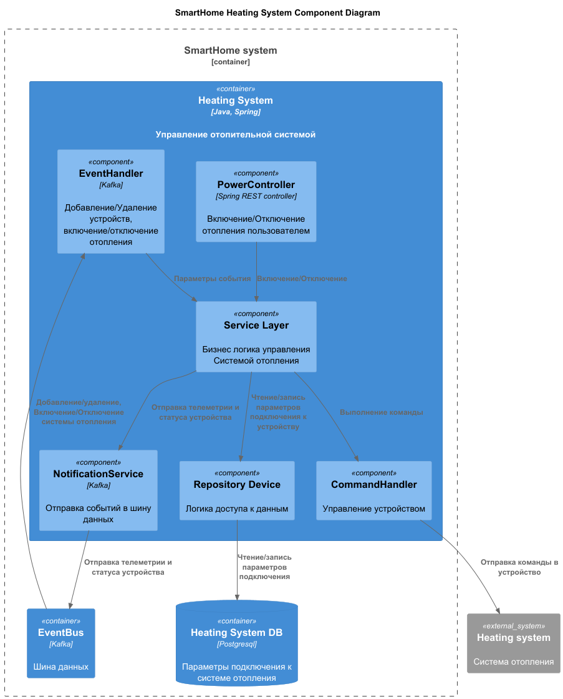

# 2 Часть
## Задание 1

RestAPI документация - [SmartHomeAPI](./api/SmartHomeAPI.yaml)

AsyncAPI документация для микросервиса home [HomeAsyncApi](./api/home.yaml)
AsyncAPI документация для микросервиса heatingSystem [HeatingSystem](./api/heating_system.yaml)

## Задание 2 - 3 
Не успеваю сделать.

# 1 Часть
## Задание 1

### 3 Домены и границы контекстов
* Домен учетных записей пользователей.
* Домен управления домом.
* Домен автоматизации управления домом.
* Домен управления отопительной системой.
* Домен управления датчиками температуры.


### 4 Проблемы текущего решения.
* Приложение синхронное. При большом количестве подключенных устройств система перестанет быстро реагировать на события от датчиков. 
* Сложно распределять задачи между командами при добавлении поддержки новых устройств. 
* При отказах приложения теряем управление умными устройствами дома. 
* Отсутствует возможность самостоятельного подключения устройств умного дома.

#### Визуализация контекста системы


## Задание 2

### 1 Декомпозиция приложений на микросервисы
* Микросервис Account - Отвечает за аутентификацию, регистрацию пользователей системы
* Микросервис Home - Отвечает за добавление новых устройств и сбора телеметрии.
* Микросервис Scenarios - Отвечает за автоматизацию управления умным домом.
* Микросервис Temperature sensor - Отвечает за сбор информации с датчиков температуры.
* Микросервис Heating system - Отвечает за настройку и управления отопительной системы.
* API GateWay - Отвечает за маршрутизацию и балансировку нагрузки.
* Kafka Event Sourcing - Шинна данных для взаимодействия микросервисов.

### 3 Визуализация архитектуры

#### C4 - Уровень контейнеров


#### C4 - Уровень компонентов

##### HeatingSystem


##### Home


#### C4 - Уровень кода

##### Последовательность добавления нового устройства


##### Последовательность добавления системы отопления


##### Последовательность управления системой отопления


## Задание 3

ER-диаграмма


---

# Базовая настройка

## Запуск minikube

[Инструкция по установке](https://minikube.sigs.k8s.io/docs/start/)

```bash
minikube start
```

## Добавление токена авторизации GitHub

[Получение токена](https://github.com/settings/tokens/new)

```bash
kubectl create secret docker-registry ghcr --docker-server=https://ghcr.io --docker-username=<github_username> --docker-password=<github_token> -n default
```

## Установка API GW kusk

[Install Kusk CLI](https://docs.kusk.io/getting-started/install-kusk-cli)

```bash
kusk cluster install
```

## Смена адреса образа в helm chart

После того как вы сделали форк репозитория и у вас в репозитории отработал GitHub Action. Вам нужно получить адрес образа <https://github.com/><github_username>/architecture-sprint-3/pkgs/container/architecture-sprint-3

Он выглядит таким образом
```ghcr.io/<github_username>/architecture-sprint-3:latest```

Замените адрес образа в файле `helm/smart-home-monolith/values.yaml` на полученный файл:

```yaml
image:
  repository: ghcr.io/<github_username>/architecture-sprint-3
  tag: latest
```

## Настройка terraform

[Установите Terraform](https://yandex.cloud/ru/docs/tutorials/infrastructure-management/terraform-quickstart#install-terraform)

Создайте файл ~/.terraformrc

```hcl
provider_installation {
  network_mirror {
    url = "https://terraform-mirror.yandexcloud.net/"
    include = ["registry.terraform.io/*/*"]
  }
  direct {
    exclude = ["registry.terraform.io/*/*"]
  }
}
```

## Применяем terraform конфигурацию

```bash
cd terraform
terraform init
terraform apply
```

## Настройка API GW

```bash
kusk deploy -i api.yaml
```

## Проверяем работоспособность

```bash
kubectl port-forward svc/kusk-gateway-envoy-fleet -n kusk-system 8080:80
curl localhost:8080/hello
```

## Delete minikube

```bash
minikube delete
```
